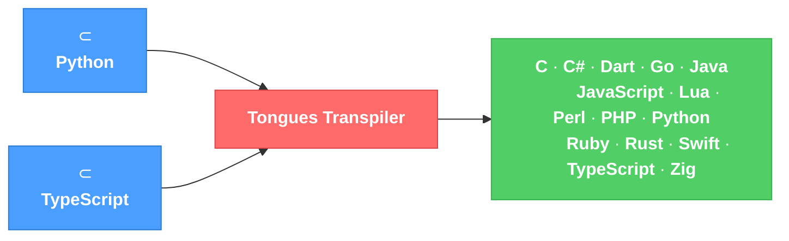

```mermaid
graph LR
    Python["⊂<br/><b>Python</b>"]:::src --> TT["<b>Tongues Transpiler</b>"]:::core
    TypeScript["⊂<br/><b>TypeScript</b>"]:::src --> TT
    TT --> Targets:::tgt

    Targets["
        <b>C</b> · <b>C#</b> · <b>Dart</b> · <b>Go</b> · <b>Java</b>
        <b>JavaScript</b> · <b>Lua</b> · <b>Perl</b> · <b>PHP</b> · <b>Python</b>
        <b>Ruby</b> · <b>Rust</b> · <b>Swift</b> · <b>TypeScript</b> · <b>Zig</b>
    "]

    classDef src fill:#4a9eff,stroke:#2d7cd4,color:#fff
    classDef core fill:#ff6b6b,stroke:#d44,color:#fff
    classDef tgt fill:#51cf66,stroke:#37b24d,color:#fff,text-align:center
```
