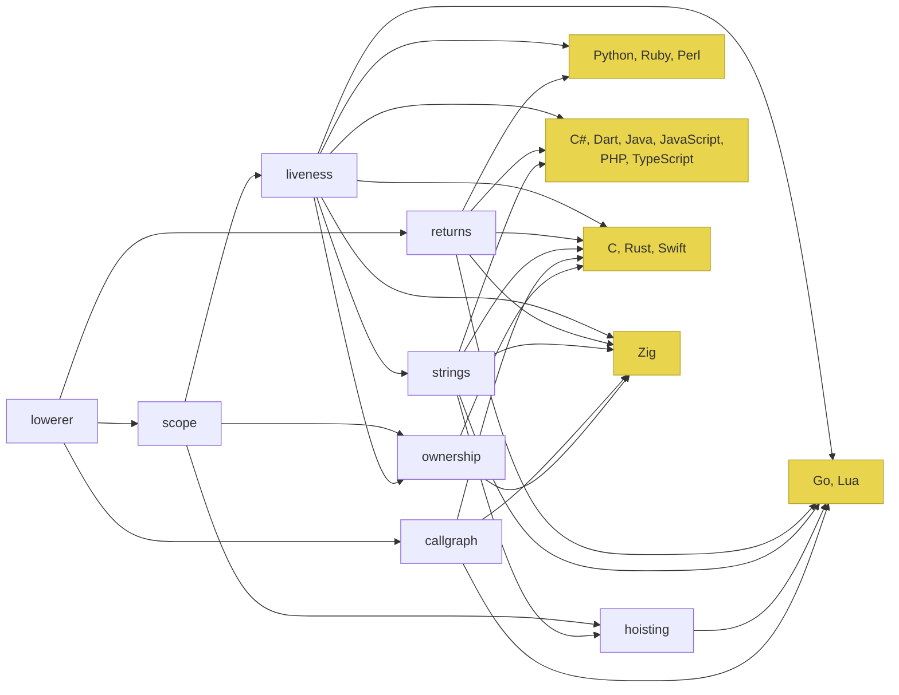

# Tongues Middleend v2

The middleend is a pipeline of analysis passes over Taytsh IR. Every pass reads the IR and annotations from prior passes, then writes new annotations. No pass modifies IR structure — the tree the lowerer produces is the tree backends read.

## Pipeline

```
lowerer → scope → returns → liveness → strings → hoisting → ownership → backends
            \                                                          /
             `--→ callgraph ---→---→---→---→---→---→---→---→---→---→-'
```

All passes are intra-procedural (per-function) except callgraph, which is inter-procedural (whole-module).

## Pass Summaries

### 1. Scope

Spec: scope-spec-v2.md

Foundation pass. Binding-level facts for every declaration site, use-site facts for every identifier reference.

Produces:
- scope.is_reassigned, scope.is_const     (all binding declarations)
- scope.is_modified, scope.is_unused      (parameters)
- scope.narrowed_type                     (use sites after nil checks / match arms)
- scope.is_interface, scope.is_function_ref (use sites)

No dependencies.

### 2. Returns

Analyze return patterns and control flow termination.

Produces:
- returns.always_returns        (block)     does every path return/throw/exit?
- returns.needs_named_returns   (function)  try/catch body returns require Go named returns
- returns.may_return_nil        (function)  function may return nil at runtime
- returns.body_has_return       (try node)  try body contains return (Lua/Perl/Zig workaround)

No dependencies. Pure control-flow walk.

### 3. Liveness

Dead store and unused binding analysis.

Produces:
- liveness.initial_value_unused   (let declaration)  init overwritten before read
- liveness.catch_var_unused       (catch binding)     catch variable never referenced
- liveness.match_var_unused       (case/default binding) binding never referenced
- liveness.tuple_unused_indices   (tuple assignment)  which targets are never used

Depends on: scope (reads scope.is_unused to avoid redundant work, but can run independently with degraded precision).

### 4. Strings

Spec: strings-spec-v2.md

String content classification and usage analysis. Tells backends when rune-decoding machinery can be skipped.

Produces:
- strings.content          (string-typed binding)  ascii | bmp | unknown
- strings.indexed          (string-typed binding)  used in s[i] or s[a:b]
- strings.iterated         (string-typed binding)  iterated via for-in
- strings.len_called       (string-typed binding)  Len(s) called
- strings.builder          (for/while loop)         accumulator variable name(s)

Depends on: scope (reads scope.is_reassigned, scope.is_const), liveness (reads liveness.initial_value_unused).

Skippable for native-rune targets. The pass is a no-op when the target set includes only Python, Ruby, and Perl.

### 5. Hoisting

Declaration placement for languages requiring pre-declaration (Go) and loop annotation for languages lacking native continue (Lua).

Produces:
- hoisting.hoisted_vars    (if/try/while/for/match)  [(name, type)] to hoist
- hoisting.has_continue    (while/for)                body contains continue
- hoisting.rune_vars       (function)                 string vars needing rune conversion (Go)

Depends on: scope (reads scope.is_reassigned to know which vars are assigned inside control structures). When the strings pass is active, `hoisting.rune_vars` is derived from `strings.indexed` rather than performing its own string-indexing detection.

### 6. Ownership

Memory ownership and escape analysis for non-GC targets (C, Rust, Zig).

Produces:
- ownership.kind      (binding declaration)  owned | borrowed | shared
- ownership.escapes   (expression)           value escapes current scope
- ownership.region    (binding declaration)  lifetime region identifier

Depends on: scope (reads scope.is_modified for mutation tracking, scope.is_const for immutability guarantees), liveness (reads initial_value_unused to avoid tracking dead stores).

Skippable for GC targets. The pass is a no-op when the target set excludes C, Rust, Zig, and Swift.

### 7. Callgraph

Spec: callgraph-spec-v2.md

Inter-procedural call graph analysis. Throw type propagation, recursion detection, tail call identification.

Produces:
- callgraph.throws              (function)    exception types that can escape
- callgraph.is_recursive        (function)    direct or mutual recursion
- callgraph.recursive_group     (function)    SCC identifier
- callgraph.is_tail_call        (call site)   call is in tail position

No dependencies on other passes. Reads raw IR only. Runs in parallel with the intra-procedural pipeline.

Skippable when the target set excludes Go, Rust, Zig, and Lua (the targets that transform exceptions into return values or need tail call syntax). Always useful for diagnostics.

## Dependency Graph

All backends read scope, returns, and liveness annotations directly. Callgraph runs in parallel with the intra-procedural pipeline (no shared dependencies). Strings sits between liveness and the target-conditional passes, feeding both backends and the hoisting pass. Native-rune targets (Python, Ruby, Perl) need only the universal passes; all other targets consume strings annotations.



## Annotation Namespacing

Each pass writes under its own namespace: scope.*, returns.*, liveness.*, strings.*, hoisting.*, ownership.*, callgraph.*. Annotations are write-once: no pass overwrites another's keys.

## Target-Conditional Passes

Not all passes are needed for all targets:

| Pass      | Always runs | Conditional                             |
| --------- | ----------- | --------------------------------------- |
| scope     | yes         |                                         |
| returns   | yes         |                                         |
| liveness  | yes         |                                         |
| strings   | no          | all targets except Python, Ruby, Perl   |
| hoisting  | no          | Go, Lua, or any target needing pre-decl |
| ownership | no          | C, Rust, Zig, Swift                     |
| callgraph | no          | Go, Rust, Zig, Lua                      |
